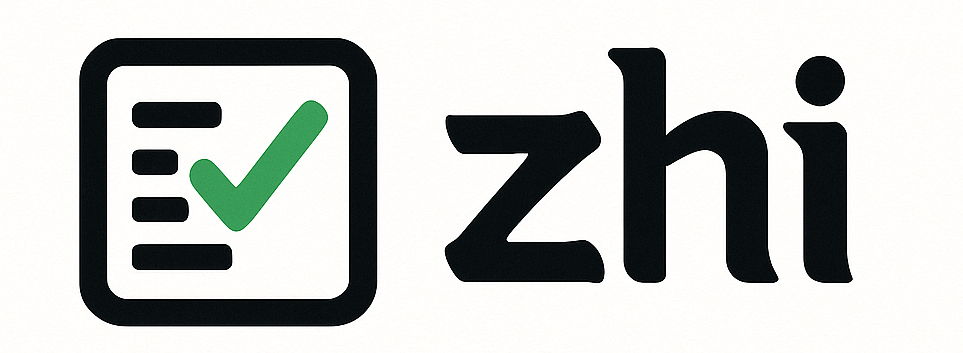
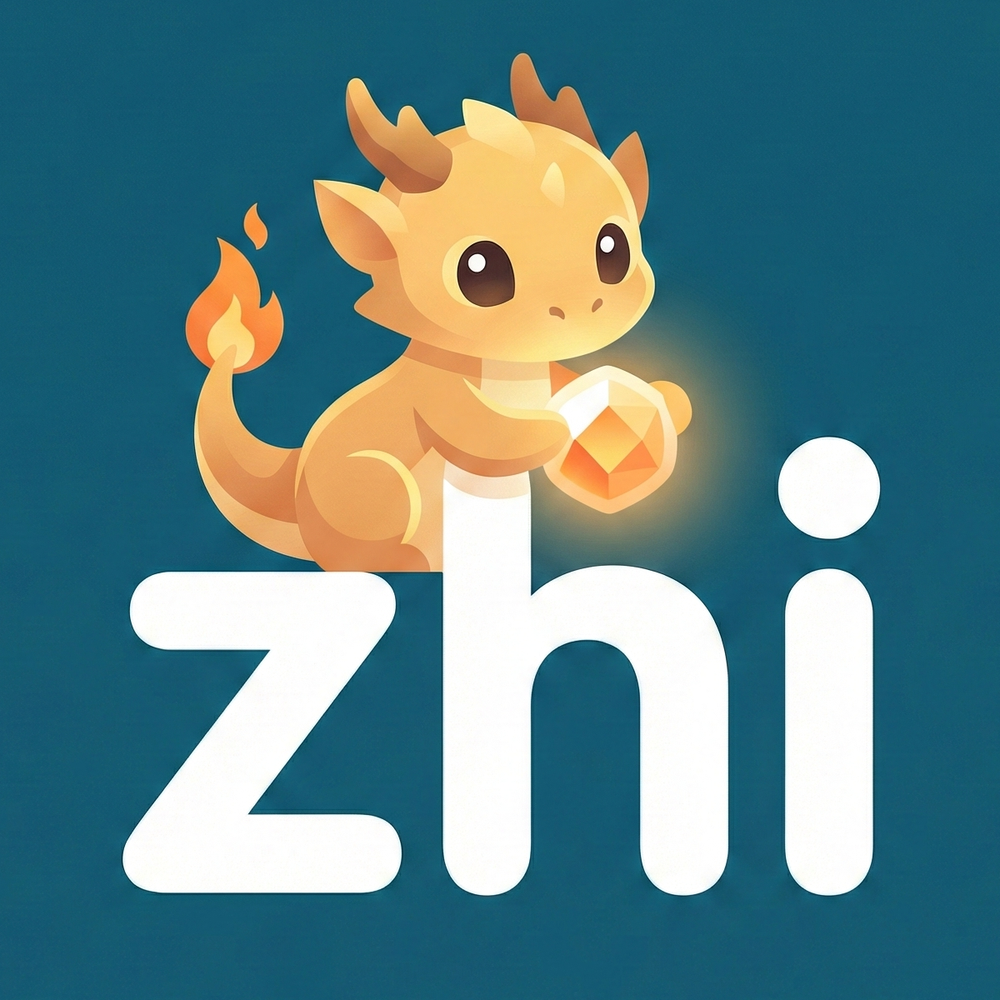

# zhi

[](https://go.dev)
[](LICENSE)
[](CODE_OF_CONDUCT.md)

**zhi** is a modern platform for **configuration management** and **provisioning**.  
It provides an extensible plugin system that automatically generates a user-friendly terminal UI, while keeping all configurations **secure by default**.

Core principles:

1. **Configuration & Validation** -- structured, validated settings that prevent misconfiguration before deployment.
2. **Secure Storage** -- encrypted at rest, ensuring confidentiality and compliance without extra setup.
3. **Modularity** -- built around an extensible plugin system, enabling support for multiple provisioning backends (Docker Compose, Kubernetes, Helm, and beyond).

---

## Introduction

Managing complex systems requires tools that are both **powerful** and **approachable**.  
**zhi** was designed to bridge the gap between secure configuration handling and intuitive provisioning workflows.

- **Configuration**: Define, validate, and manage settings consistently.
- **Provisioning**: Deploy to your environment of choice, starting with Docker Compose and Kubernetes/Helm.
- **Extensibility**: Plugins automatically gain a terminal UI, reducing friction for both developers and operators.

Think of it like a Pokedex for your infrastructure -- it knows every configuration
entry by heart, validates them on sight, and never lets a misconfiguration slip
past the tall grass into production.

---

## Features

- 🔐 **Encrypted configuration at rest**
- ⚙️ **Automatic validation of settings**
- 🧩 **Plugin-based extensibility [leveraging gRPC](https://github.com/hashicorp/go-plugin)**
- 🖥️ **Auto-generated TUI for all modules, with love and [🫧 charm](https://github.com/charmbracelet/bubbletea)**
- 🚀 **Provisioning with Docker Compose & Kubernetes/Helm (or just bring your own)**

---

## Getting Started

*Coming soon...*

---

## Examples

The [`examples/`](examples/) directory contains fully working plugins you can
build and experiment with. Build everything with:

```sh
make build-all
```

See the [examples README](examples/README.md) and the
[plugin documentation](docs/) for more details.

---

## Contributing

Contributions are welcome -- whether it's a bug fix, a new plugin idea, or
improving documentation. Every contribution helps zhi evolve.

Please read the [Contributing Guide](CONTRIBUTING.md) to get started. The
short version:

```sh
git clone https://github.com/MrWong99/zhi.git
cd zhi
make deps
make check
```

Before opening a pull request, make sure `make check` passes.

---

## Community

- [**Code of Conduct**](CODE_OF_CONDUCT.md) -- how we treat each other
  (tl;dr: be a good Trainer)
- [**Contributing Guide**](CONTRIBUTING.md) -- setup, workflow, and code style
- [**Security Policy**](SECURITY.md) -- how to report vulnerabilities
- [**Issue Templates**](.github/ISSUE_TEMPLATE/) -- bug reports, feature
  requests, and plugin ideas

---

## The Origin of the Name



The name **zhi** (pronounced roughly *"jrr"* in Mandarin) carries layered meanings:

- In **Chinese (置)**, *zhi* means *"to place, set, arrange"* -- directly resonating with configuration and provisioning.
- In **Chinese (智)**, *zhi* means *"wisdom, knowledge"* -- emphasizing security, clarity, and correctness.

This multiplicity reflects the project's vision:
to **arrange systems securely**, with **wisdom in design**, while remaining **flexible and modular**.

---

## License

[MIT](LICENSE) -- Copyright (c) 2025 Lukas Schmidt
