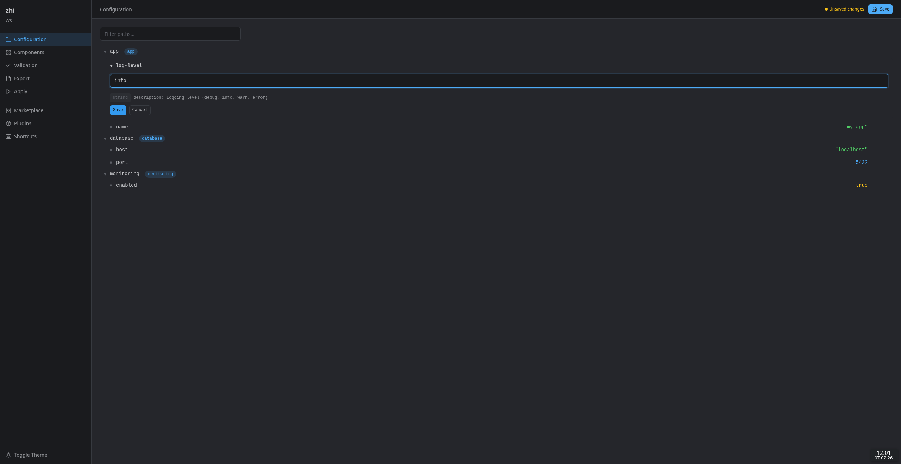

# Web UI

The zhi Web UI is a browser-based interface for managing configuration. It provides a visual tree browser, value editor, validation dashboard, export/apply controls, component management, and a plugin marketplace.



## Setup

The Web UI is a built-in UI plugin. Enable it in your workspace configuration:

```yaml
# zhi.yaml
ui:
  provider: webui
  options:
    addr: "127.0.0.1:8080"
    auto_open: true
```

Or launch it directly:

```sh
zhi edit --ui webui
```

## Configuration

### Environment Variables

| Variable | Description | Default |
|----------|-------------|---------|
| `ZHI_WEBUI_ADDR` | Listen address (host:port) | `127.0.0.1:8080` |
| `ZHI_WEBUI_AUTO_OPEN` | Open browser on start (`true`/`false`) | `true` |
| `ZHI_WEBUI_DEV` | Enable developer mode (`true`/`false`) | `false` |
| `ZHI_WEBUI_TEMPLATE_DIR` | Filesystem path for template reloading (dev mode only) | _(none)_ |
| `ZHI_WEBUI_TLS_CERT` | Path to TLS certificate PEM file | _(none)_ |
| `ZHI_WEBUI_TLS_KEY` | Path to TLS private key PEM file | _(none)_ |
| `ZHI_WEBUI_TLS_CLIENT_CA` | Path to CA PEM for client cert verification (mTLS) | _(none)_ |
| `ZHI_WEBUI_TLS_MIN_VERSION` | Minimum TLS version (`1.2` or `1.3`) | `1.2` |
| `ZHI_WEBUI_TLS_CIPHER_SUITES` | Comma-separated list of allowed cipher suites | Go defaults |

### Workspace Options

| Option | Type | Description |
|--------|------|-------------|
| `addr` | string | Listen address |
| `auto_open` | bool | Open browser automatically |
| `dev_mode` | bool | Enable developer mode |
| `template_dir` | string | Template directory for live reloading |
| `tls_cert` | string | Path to TLS certificate PEM file |
| `tls_key` | string | Path to TLS private key PEM file |
| `tls_client_ca` | string | Path to CA PEM for client cert verification (mTLS) |
| `tls_min_version` | string | Minimum TLS version (`1.2` or `1.3`) |
| `tls_cipher_suites` | string[] | List of allowed TLS cipher suite names |

## Features

### Configuration Tree

The tree view displays all configuration paths in a hierarchical explorer. Click any leaf node to see its value. Use the filter bar to narrow paths by substring.

HTMX-powered partial updates keep the UI responsive -- only changed sections are re-rendered on interaction.

### Value Editor

Click the edit button on any leaf node to open an inline editor. The editor auto-detects value types (string, number, boolean) and provides appropriate input controls. Multiline strings and metadata-driven dropdowns are supported.

Changes are validated inline before saving. Blocking validation errors prevent the save and display the error message in the editor.

### Validation

The validation page runs all configured validators and groups results by severity:

- **Blocking** -- must be resolved before saving
- **Warning** -- advisory issues
- **Info** -- informational messages

Each result links back to the relevant configuration path.

### Components

Components are named groups of configuration paths. The components page shows all configured components with their enable/disable state, mandatory flag, paths, and dependencies. Toggle components on or off (mandatory components cannot be disabled).

### Export

Export configuration to files using configured templates. Supported formats include JSON, YAML, TOML, and dotenv. Features:

- **Preview** -- dry-run an export to see the output before writing
- **Export** -- write to the configured output path
- **Export All** -- export all configured templates at once

### Apply

Run provisioning commands with real-time streaming output. The apply page shows a terminal-like view with SSE-based live output. Pre-export is available to regenerate files before applying.

### Marketplace

Browse, search, and install community plugins from the OCI registry. Features:

- Search by name, type, publisher
- Filter by plugin type (config, transform, store, ui)
- Sort by relevance, downloads, or rating
- View detailed plugin information, versions, and ratings
- Rate plugins directly from the detail page

### Installed Plugins

View all installed plugins, check for updates, and manage the plugin lifecycle:

- View version, source, and verification status
- Update individual plugins or all at once
- Uninstall external plugins

## Keyboard Shortcuts

| Shortcut | Action |
|----------|--------|
| `Ctrl+S` | Save configuration |
| `Ctrl+E` | Go to Export |
| `Ctrl+Shift+A` | Go to Apply |
| `Ctrl+M` | Go to Marketplace |
| `Ctrl+P` | Go to Plugins |
| `/` | Focus search/filter |
| `?` | Show keyboard shortcuts |

## Developer Mode

Enable developer mode for template hot-reloading during UI development:

```sh
export ZHI_WEBUI_DEV=true
export ZHI_WEBUI_TEMPLATE_DIR=/path/to/zhi/pkg/providers/ui/webui
```

In dev mode, templates are re-parsed from the filesystem on every request. This allows editing HTML templates and seeing changes immediately without rebuilding.

Route registrations are logged at startup for debugging.

## TLS Configuration

The Web UI supports TLS and mutual TLS (mTLS) for encrypted and authenticated connections.

### Enabling TLS

Provide a certificate and key via environment variables:

```sh
export ZHI_WEBUI_TLS_CERT=/path/to/server.crt
export ZHI_WEBUI_TLS_KEY=/path/to/server.key
zhi edit --ui webui
```

Or via workspace options in `zhi.yaml`:

```yaml
ui:
  provider: webui
  options:
    addr: "0.0.0.0:8443"
    tls_cert: "/path/to/server.crt"
    tls_key: "/path/to/server.key"
    tls_min_version: "1.3"
```

### Mutual TLS (mTLS)

Require client certificates for authentication:

```yaml
ui:
  provider: webui
  options:
    addr: "0.0.0.0:8443"
    tls_cert: "/path/to/server.crt"
    tls_key: "/path/to/server.key"
    tls_client_ca: "/path/to/client-ca.crt"
```

When `tls_client_ca` is set, clients must present a certificate signed by the specified CA.

## Security Features

The Web UI includes several security measures:

- **CSP nonces** -- every response includes a unique Content-Security-Policy nonce for inline scripts and styles
- **CSRF protection** -- double-submit cookie pattern with HMAC-SHA256 tokens on all state-changing requests
- **Security headers** -- X-Content-Type-Options, X-Frame-Options (DENY), Referrer-Policy, Permissions-Policy, Cross-Origin-Opener-Policy
- **Gzip compression** -- automatic response compression (skipped for SSE streams)
- **Content-hashed assets** -- static files are served with content-hash URLs and immutable cache headers for optimal caching
- **ETag support** -- static file responses include ETag headers for conditional requests
- **Localhost binding** -- the server binds to `127.0.0.1` by default, refusing remote connections
